## Prelude

This post will give a basic tutorial on how to using Docker. The topics that will be explained are:

* **What is Docker**

* **Docker Architecture**

* **Start using Docker (Guide to using basic commands)**

* **Create Image using Dockerfile**

* **Handle Image using Environment Variable**

* **Integrate Container Networking**

* **Manage Data in Docker**

* **Docker Compose**

* **Docker Tools**

* **Docker Cheat-sheet**

This post will be pretty long, and I hope you will enjoy it, and feel free to give feedback to help me improve this tutorial.

Thanks, and enjoy it!

## What Is Docker?

<br/>*Photo by [Ian Taylor](https://unsplash.com/@carrier_lost?utm_source=medium&utm_medium=referral) on [Unsplash](https://unsplash.com?utm_source=medium&utm_medium=referral)*

**[Docker](https://docs.docker.com/get-started/overview/)** is a configuration management tool that is used to automate the deployment of software in lightweight containers. These containers help applications to work efficiently in different environments. By using Docker, developers can quickly build, pack, ship, and run applications as lightweight, portable, self-sufficient containers and running virtually anywhere.¹ Containers allow developers to package an application with its dependencies and deploy it as a single unit. By providing prebuilt and self-sustaining application containers, developers can focus on the application code and use it without worrying about the underlying operating system or deployment system.²

## Docker Architecture

The core concepts of Docker are images and containers. A Docker image contains everything that is needed to run your software: the code, a runtime (for example, Java Virtual Machine (JVM), drivers, tools, scripts, libraries, deployments, and more.
A Docker container is a running instance of a Docker image. However, unlike in traditional virtualization with a type 1 or type 2 hypervisor, a Docker container runs on the host operating system’s kernel. Within a Docker Image, there is no separate operating system, as illustrated below.³

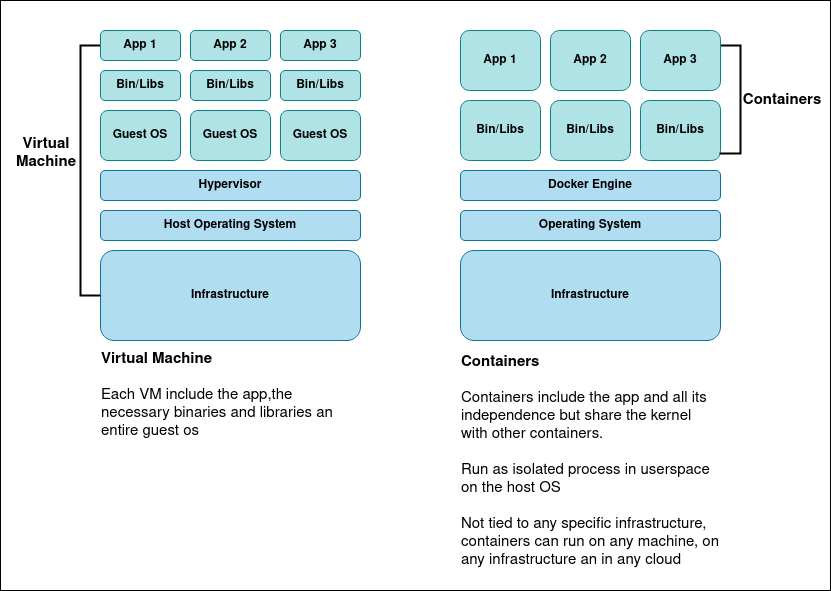<br/>*Docker Architecture*

Every Docker container has its own file system, network stack (and therefore its own IP address), process space, and defined resource limitations for CPU and memory. Since a Docker container does not have to boot an operating system, it starts up instantly. Docker is about isolation, i.e., separating the resources of a host operating system, as opposed to virtualization, i.e., providing a guest operating system on top of the host operating system.

### Image

Image is a read-only file with a bunch of instructions. When these instructions are executed, it creates a Docker container. We can say that an Image is a template to create a container.

### Container

A container is a software package that has all the dependencies required to run an application. When running a container, it uses an isolated filesystem.

### Container Registry

Docker Container Registry is where we put Docker Image remotely before deploying it to the server. In another way, it is a standard way to store and distribute Docker images. It also helps improve access control and security of docker images stored in its repository. While managing the distribution of Images, it can also integrate with application development workflow. Developers can set up their own Container Registry because it is an open-source-based repository under the permissive Apache license. You can also use a hosted Container Service such as Docker Hub or Azure Container Registry, etc.

## Installing a Docker

I won’t cover how to install Docker. There are many tutorials on how to install Docker into your machine. For me, I prefer using the official document. You can see the instruction [here](https://docs.docker.com/engine/install/).

## Start Using Docker

After you install the Docker, let’s get into it!

### Pull Image from Registry

**Check the image on our local**

```
$ docker images
```


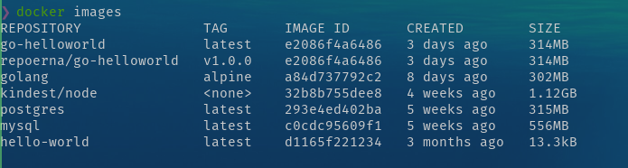<br/>*Image list*

if you newly install Docker, you won’t see anything on the list. You will just see the header result, **`REPOSITORY`**, **`TAG`**, **`IMAGE ID`**, **`CREATED`**, **`SIZE**.`

**Pull the image**

To pull an image you can use the command:

```
$ docker pull <image-name>
```


or for a specific image version

```
$ docker pull <image-name>:<tag-name>
```


For this example, we will use MongoDB image. You can check it **[here](https://hub.docker.com/_/mongo/)**. If you open the link, you can see on the right, there is a command that tells you how to pull the image.

<br/>*Docker hub*

On the **`Tags`** menu, you can see the available version of the image

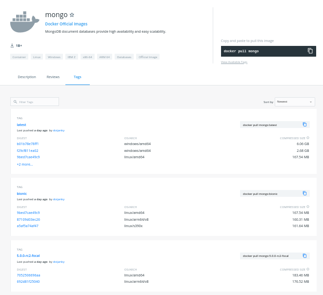<br/>*Docker hub tags menu*

Copy the image pull command, and run it on your terminal. You will see that the image is being pulled from the registry to our local machine.

<br/>*Pulling image*

If we do not specify the tag name, it will automatically pull the latest image on the registry. After Image pulling is finished, we can recheck the images list, you will see mongo on the list

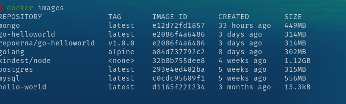<br/>

### Create Container

**Check running container.**

To check the running container, you can use

```
$ docker container ls
```


It will show only the** **running container, but if you have some container that stopped, it won’t show on the list. To see all containers that we have, we can use

```
$ docker container ls --all
```


You can use **`--all`** or **`-a**.` It will show all the containers you have on your local machine. You can see on the image there are some containers running, and some containers stopped.

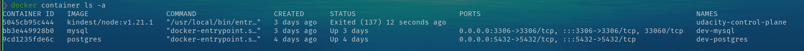<br/>

You can see on the image there are some containers running, and some containers stopped.

**Creating container**

There are many ways to create a container. These commands are:

```
$ docker container create <image-name>
```


to create a container with a specific image tag

```
$ docker container create <image-name>:<tag>
```


to create a container with a predefined name, we can use **`--name`** argument on our command

```
$ docker container create --name <some-container-name> <image-name>:<tag>
```


For the example, let’s create a container for our pulled MongoDB image,

```
$ docker container create --name test-mongo mongo
```


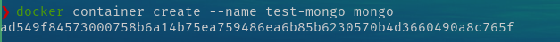<br/>

let’s check it using our container,

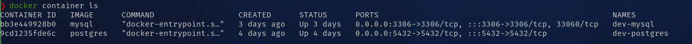<br/>

You can see that there is no test-mongo container. This happens because using the container create command just creates the container and not started it. You can try using`docker contaner ls -a` command to see the container.

You can also create multiple containers from the same image with one condition; the container name must be different because the container name is unique. If you create a container without specifying the name, Docker will generate a random name for the container.

### Start Container

After we create the container, we can run it using the command

```
$ docker container start <container-name>
```


<br/>

After we run the command, let's check our container list,

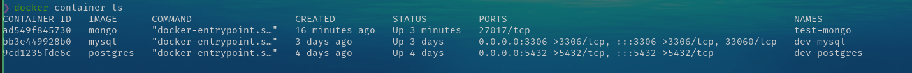<br/>

As you can see, our **`test-mongo`** is already up and running. In our case, you can see. In our case, you can see **`PORTS`** section of **`test-mongo`** container, we can access the container by using port **`27017`**.

Let’s try connecting to MongoDB. You can use a DB client that supports MongoDB connections like [Robo3T](https://robomongo.org/), but I’m using Datagrip.

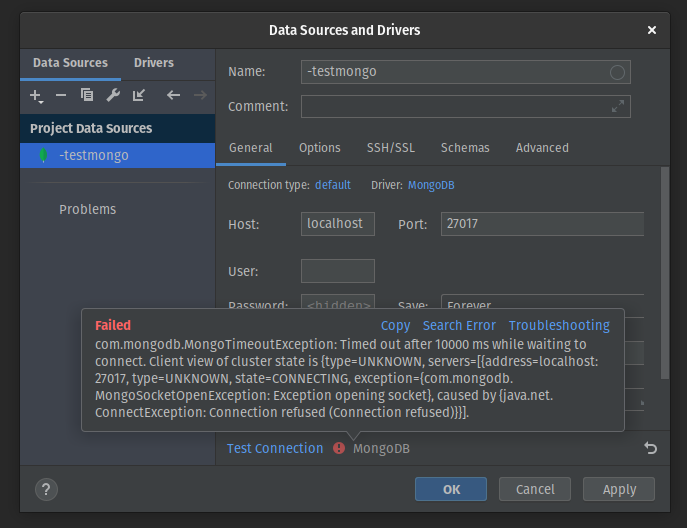<br/>

So, we can’t connect to our MongoDB. Why is this happening? Well, this is because **`PORTS`** the info that we see before is port on the container. The container’s behavior is that it will create an isolate the system, which means that we can’t access the system without exposing the port, so it can’t access the outside of the container.

### Open Port

So, how can we expose the container’s port? To achieve that, we should consider passing an argument **`-p`** or **`--port`** when we create the container, so the command will look like this

```
$ docker container create --name <container-name> -p <external-port>:<container-port> <image-name>:<tag>
```


Let’s try creating a new container

<br/>

I will explain the command.

**`container-port`** i is a predefined port that already assigns when building the Image. If we were using the Image that we get from the docker registry, we could see the documentation of the Image for ports information. In this case, MongoDB using port **`27017`**.

And in the **`external-port`**, I use port **`8011`**. It means, when I’m using port `8011 `outside the container (or on my local machine), every request that comes through the port **`8011`** will be forwarded to port **`27017`** inside the container.

Try to start the new container, and with this, we can access MongoDB.

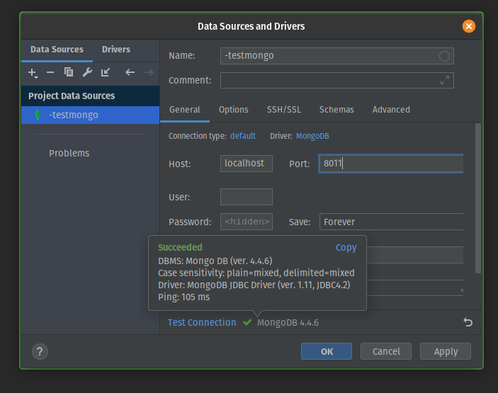<br/>

### Remove Container

To remove the container we use the command

```
$ docker container rm <container-name>
```


Let’s try to delete **`test-mongo`** container

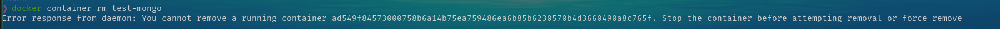<br/>

An error will occur. This happens because Docker wants that we to stop the container before we remove it. There is two way to handle this,

* Stop the container using

```
$ docker container stop <image-name>
```


and then run the container remove command again

* Force delete the container by using an argument **`--force`**

```
$ docker container rm <image-name> --force
```


Please ensure that you know what you are doing when using this command.

For this example, I will use option 2,

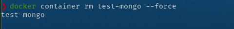<br/>

You can try to recheck the container list to ensure the container is already removed.

### Remove Image

Same with removing the container, we can’t remove an image before all container that uses that Image is removed. To remove an image, you can use the command

```
$ docker image remove <imange-name>:<tag>
```


Let’s stop and remove the container, and then remove the `mongo` image.

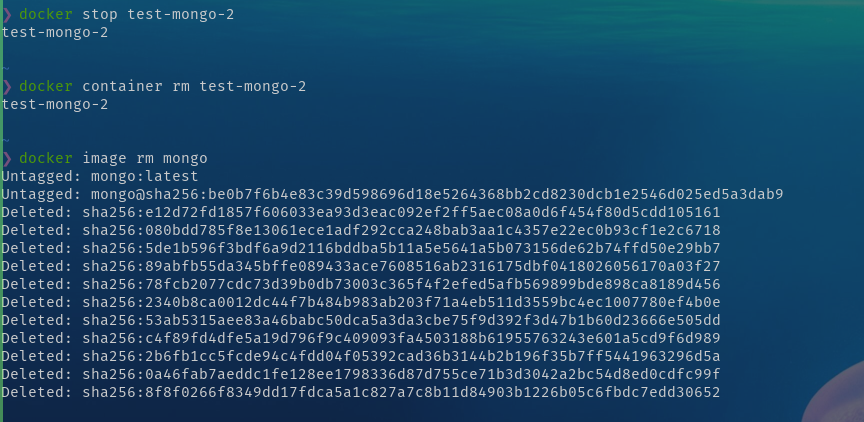<br/>

### Docker Logs

We can see docker logs to help us debug our application inside the container. To do that, we can use the command

```
$ docker logs <container-name>
```


You can try to create some containers and check the container’s logs. This is an example of my Postgres container.

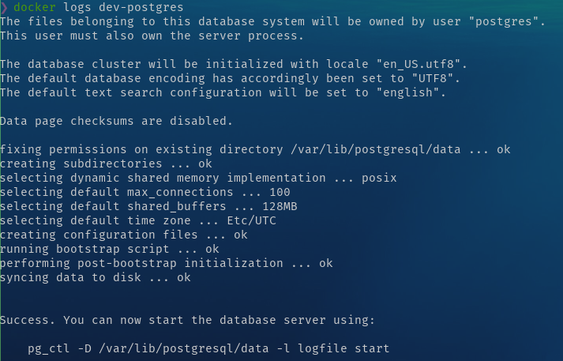<br/>

### Getting through inside the container

Even though the container is isolated from the outside of the container, Docker has some commands that we can use to pass a command inside our container. We can use the command

```
$ docker exec <option> <container-name> <command>
```


you can see more about docker exec [here](https://docs.docker.com/engine/reference/commandline/exec/)

I will demonstrate using my `postgre` named `dev-postgres`to get into Postgres client inside the container.

<br/>

You can see that I am running a command to show the database list inside the container **`-it`** means **`interactive`** (Keep STDIN open) and tty (Allocate a pseudo-TTY).

## Create Image with Dockerfile

We already use Docker with the Image from the container registry, but how if we want to create an Image? Here comes the Dockerfile. Dockerfile is a simple text file that consists of instructions to build Docker images. Dockerfile consists of commands that guide you on how to build a specific Docker image.

For example, we need to prepare some application code to demonstrate how to build an application image. We will create 2 files, the application code, and the Dockerfile. For the application code, I will make a simple HTTP app using Go. You don’t need to have Go runtime on your computer because we will have our app inside the container then have Go runtime in it.

### Prepare an app

```
package main

import (
	"fmt"
	"net/http"
)

func main() {


	// * Handle Route "/"
	http.HandleFunc("/", func(w http.ResponseWriter, r *http.Request) {
		fmt.Fprintf(w, "<h1>Hello Docker!</h1>")
	})


    http.ListenAndServe(":8000", nil)
}
```


### Create a Dockerfile

```
# BUILD IMAGE FROM EXISTING IMAGE
# Line with '#' will not executed

# 1. Call the image
# FROM <image name>:<tag>
# for the base we will use golang image version 1.15

FROM golang:1.15

# 2. Copy file that needed in this image
# COPY <source> <destination>
# we will put file main.go in /app/main.go inside the container

COPY main.go /app/main.go

# 3. Telling the image how to run the app
# CMD [<add command using array>]

CMD ["go", "run", "/app/main.go"] # same with "go run /app/main.go"
```


## Build Image

we can use 3 way to build an image:

* simple way

**`docker build &lt;path-to-dockerfile&gt;`**

* add a name in our image

**`docker build --tag &lt;app name&gt; &lt;path-to-dockerfile&gt;`**

* add name and version number

**`docker build --tag &lt;app name&gt;:&lt;version number&gt; &lt;path-to-dockerfile&gt;`**

```
$ docker build --tag app-golang:1.0 .
```


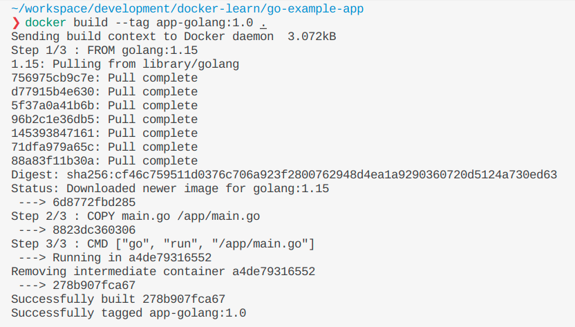<br/>

building an image using Dockerfile can be done in various ways, depends on your needs, and many Dockerfile syntaxes are often used when creating an image, such as:

* ENTRYPOINT

* RUN

* WORKDIR

* ENV

read this docker **[documentation](https://docs.docker.com/develop/develop-images/dockerfile_best-practices/)**, get to know all the syntax, and see the best practice of using it.

### Create our app container

Let’s try to create a container for our app and run it. Then we can check our app using the browser.

<br/>

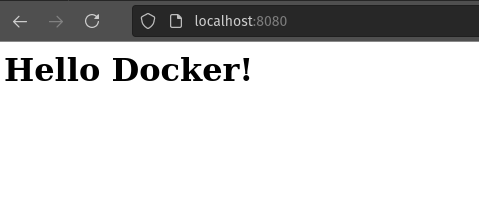<br/>

### Upload Image to Registry

**Preparation**

* Login to your account at [https://hub.docker.com/](https://hub.docker.com/)

<br/>

* Create New repository for the image

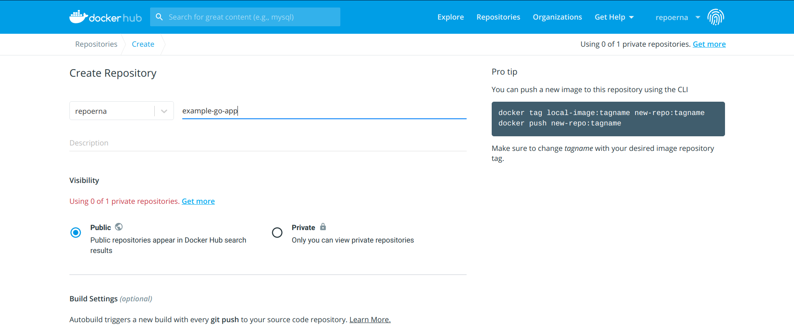<br/>

**Push image**

We will use the docker command to push the image, **`docker push &lt;repository name&gt;:&lt;tag&gt;`**

<br/>

If we try to insert the command, we will get an error: `An image does not **exist locally ...`**

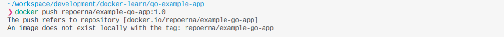<br/>

This will happen because we create an image with a name that is different from our repository name. Let’s check the Image in our local, using:

```
$ docker images
```


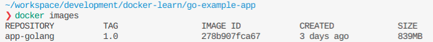<br/>

our local image is named **app-golang** but the docker registry wants **repoerna/example-go-app**.

To resolve this, we need to do create the image with different names by using

```
$ docker tag <local-image>:<tagname> <reponame>:<tagname>
```


check docker images in our local, we will see the new image created,

<br/>

after that, we can push to the repository, by using the same command we used before

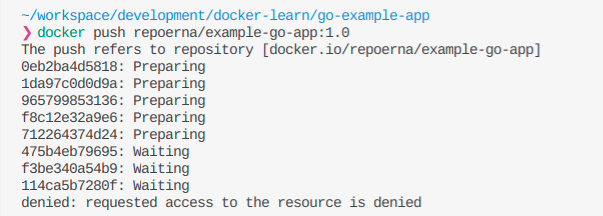<br/>

Oops! We still get an error, our request to push is denied. It is because, our local docker didn’t know, where to push the image.

We need to login, by using

```
$ docker login
```


input your account credential for the docker hub

<br/>

after we logged in, let's try to push again

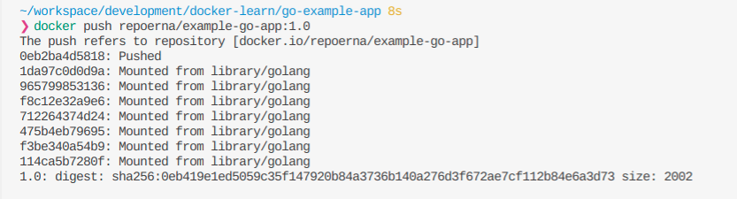<br/>

Alright! We success push our local image to the remote repository, lets check in the docker hub

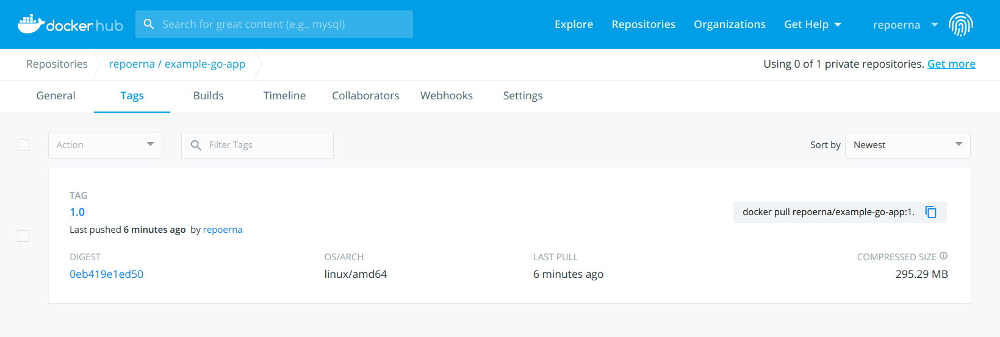<br/>

​ For details about the docker repository, you can read the **[documentation](https://docs.docker.com/docker-hub/repos/)**

## Handle Image with Environment Variable
> *An **environment variable** is a dynamic-named value that can affect the way running processes will behave on a computer. They are part of the environment in which a process runs. **— Wikipedia***

An environment variable is rarely used directly. It is usually used by a program to configure itself. In software development, some configurations for the program/ application are set by using an environment variable. If we want our program to change some configuration, we can achieve this by changing the environment variable without changing the code.

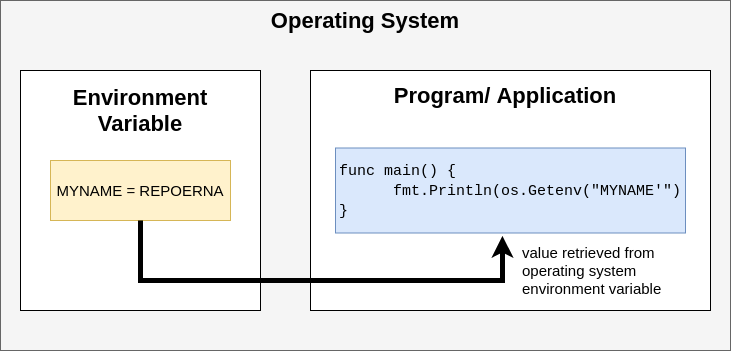<br/>

in Linux or macOS, you can see your OS environment variable using the command

```
$ printenv
```


if you using Windows, you can access the environment variable by open **Control Panel &gt; Advanced system settings &gt; Environment Variable**. You will see the Environment Variable window.

<br/>

If we want to dockerize our program that needs an environment variable, we should add some commands before running the container.
To give you an example, let’s update our program to handle some environment variables. We will add a new route to manage the environment variable.

```
package main

import (
	"fmt"
	"net/http"
	"os"
)

func main() {
package main

import (
	"fmt"
	"net/http"
	"os"
)

func main() {
	// * this will set env variable MYNAME
	// os.Setenv("MYNAME", "REPOERNA")

	// * get env variable MYNAME
	appPort := os.Getenv("APP_PORT")
	port := fmt.Sprintf(":%s", appPort)

	myName := os.Getenv("MYNAME")
	txt := fmt.Sprintf("<h1>Hello, %s</h1>", myName) // <-- env var MYNAME will be used in this line

	// * Handle Route "/"
	http.HandleFunc("/", func(w http.ResponseWriter, r *http.Request) {
		fmt.Fprintf(w, "<h1>Hello Docker!</h1>")
	})

	// * Handle route "/myname"
	http.HandleFunc("/myname", func(w http.ResponseWriter, r *http.Request) {
		fmt.Fprintf(w, txt)
	})

	http.ListenAndServe(port, nil) // <-- env var APP_PORT will be used in this line
}
```


Remember, in our program, we need two environment variables, APP_PORT and MYNAME. After updating our program, rebuild it without changing the Dockerfile.

```
$ docker build --tag app-golang:1.0 .
```


and then create a container using the image, and add `-e`to add an environment variable

```
$ docker container create --name golang-test-env -p 8080:8080 -e APP_PORT=8080 -e MYNAME=REPOERNA app-golang:1.0
```


after the container is created, let’s inspect the environment variable in it by using the command

```
$ docker container inspect golang-test-env
```


In the list, you will see in `Env` with `APP_PORT` and `MYNAME.` The value is the same as the command that we type before. For `PATH`, `GOLANG_VERSION`, `GOPATH` are automatically added, because we use golang in our Dockerfile.

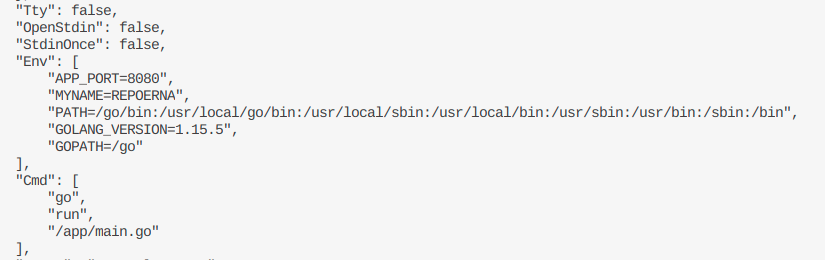<br/>

So let's run the container, to check our program is working

```
$ docker container start golang-test-env
```


if no error occurred, open in browser *localhost:8080/myname*, it will show the `MYNAME` environment variable value.

<br/>

* Note: when using a Dockerfile to create an image, you can specify the environment variable inside your Dockerfile. Please see the official documentation on how to implement that.

## Integrate Container Networking

In this section, we will talk about connecting containers to another container. Let say we have a web server that needs to communicate with Postgres for its database and Redis for its caching or session storage.

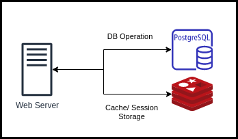<br/>

So, we will prepare 3 containers, one for the app, one for Postgres, and one for Redis. Before that, let’s prepare our app. We will be using our previous app and add some code to connect with Postgres and Redis.

### Update our app

**main.go**

We will add some database connections to our app.

```
Package main

import (
	"database/sql"
	"fmt"
	"net/http"
	"os"

	"github.com/go-redis/redis"
	_ "github.com/lib/pq"
)

func main() {

	dbHost := os.Getenv("DB_HOST")
	dbPort := 5432
	dbUser := "postgres"
	dbPass := "Secure123"
	dbName := "docker-demo"
	redisHost := os.Getenv("REDIS_HOST")
	redisAddr := fmt.Sprintf("%s:6379", redisHost)
	redisPass := "" //no password set
	redisDB := 0    //default db

	// * setup postgre connection
	dsn := fmt.Sprintf("host=%s port=%d user=%s "+
		"password=%s dbname=%s sslmode=disable",
		dbHost, dbPort, dbUser, dbPass, dbName)
	db, err := sql.Open(
		"postgres",
		dsn,
	)
	if err != nil {
		fmt.Println(err)
	}

	// * Ping for test the connection
	if err = db.Ping(); err != nil {
		fmt.Println(err)
	} else {
		fmt.Println("DB Postgres Connected !")
	}

	// * setup redis connection
	rdb := redis.NewClient(&redis.Options{
		Addr:     redisAddr,
		Password: redisPass,
		DB:       redisDB,
	})

	// * Ping for test the connection
	pong, err := rdb.Ping().Result()
	if err != nil {
		fmt.Println(err)
	} else {
		fmt.Println(pong)
		fmt.Println("Redis Connected !")
	}

	// * get env variable MYshNAME
	appPort := os.Getenv("APP_PORT")
	// handle for default port
	if appPort == "" {
		appPort = "8080"
	}
	port := fmt.Sprintf(":%s", appPort)

	// myName := os.Getenv("MYNAME")
	// txt := fmt.Sprintf("<h1>Hello, %s</h1>", myName)

	// * Handle Route "/"
	http.HandleFunc("/", func(w http.ResponseWriter, r *http.Request) {
		fmt.Fprintf(w, "<h1>Hello Docker!</h1>")
	})

	// * Handle route "/myname"
	// http.HandleFunc("/myname", func(w http.ResponseWriter, r *http.Request) {
	// 	fmt.Fprintf(w, txt)
	// })

	http.ListenAndServe(port, nil)
}
```


For Postgres and Redis hostname, we will use an environment variable, and because we are using Redis, we need to use modules in our go app. Therefore we need to update our Dockerfile to handle go modules.

**Dockerfile**

```
FROM golang:1.15

ENV GO111MODULE=on

WORKDIR /app


RUN go mod init

COPY . .

RUN CGO_ENABLED=0 GOOS=linux GOARCH=amd64 go build

EXPOSE 8080
CMD ["go", "run", "/app/main.go"]
```


After the app is ready, we will continue preparing the container, and don’t forget to clean up the previous container

### Create Container

* Rebuild our golang app image

```
$ docker build — tag app-golang:1.0 .
```


* Create golang app container

```
$ docker container create — name golang-docker -e REDIS_HOST=localhost -e DB_HOST=localhost -p 8080:8080 app-golang:1.0
```


* Create Postgres container

```
$ docker container create --name postgres-docker -p 5432:5432 -e POSTGRES_DB=docker-demo -e POSTGRES_PASSWORD=mysecretpassword postgres
```


* Create Redis container

```
$ docker container create --name redis-docker -p 6379:6379 redis
```


let’s see our created containers

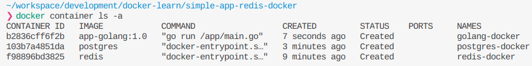<br/>

### Start Containers

start all 3 containers

```
$ docker container start redis-docker postgres-docker golang-docker
```


check our app container

```
$ docker container logs golang-docker
```


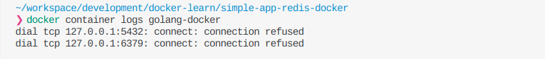<br/>

As I expected, an error will happen because we were trying to connect to localhost. We can’t connect to localhost because Redis and Postgres are in a different containers. We need to use the container name as the hostname. So, let’s delete `golang-docker`container and re-create it.

```
$ docker container create --name golang-docker -e REDIS_HOST=redis-docker -e DB_HOST=postgres-docker -p 8080:8080 app-golang:1.0
```


Start the container, and check logs again.

<br/>

We still can’t connect to Redis and Postgres. What happens here? As you can see, there is an error occur in our app. This will occurred because our program still can’t find Redis and Postgres. Before using *localhost* or *127.0.0.1* as the host, localhost refers to the hostname in the current computer or system.

As you know, **when creating a container, the system inside it will be isolated from another container**. Even if we want the container to connect to our laptop or computer, we need to expose the container port and mapping it to our computer port. But, after we changed the hostname to the container name, errors still occurred. So **how to make containers communicate with each other?**

### Setup Container Network

To achieve that, we need to use **docker network**, which will help us connecting containers

```
$ docker network --help
```


* Create docker network

```
$ docker network create example-network
```


we can check our created network by using

```
$ docker network ls
```


* Set container network

```
$ docker network connect example-network golang-docker
$ docker network connect example-network redis-docker
$ docker network connect example-network postgres-docker
```


After we connect the containers to the network, let's inspect our container

```
$ docker container inspect golang-docker
```


You can see in "Networks", there is **example-network**, that we created before.

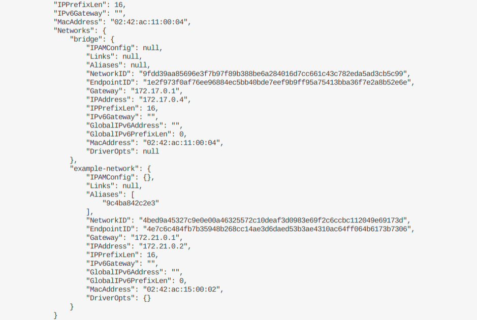<br/>

Let's restart our golang-app container, and check the logs

```
$ docker container restart golang-docker
```


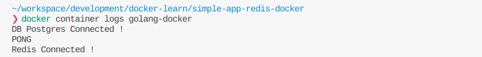<br/>

Finally, it's connected! Congratulations to us!

## Manage Data in Docker

When creating an application, it is best to make it stateless. It means no data are saved or the data stored somewhere else. However, some applications need to be stateful, for example, databases. How do we run a stateful application? How can we save the data so when we delete a container, the data will still remain?

Actually, you can read the documentation about that [here](https://docs.docker.com/storage/)

There are many ways to manage data in Docker. Usually, I will use bind mounts, but we will try to use volume this time.

In this example, we will try to create a MongoDB container. To manage data, first, we must know where is application save its data. If you use [mongo image from docker hub](https://hub.docker.com/_/mongo), we can see in the description at subtitle Where to store data, from there we can see where is mongo data reside, it’s in /data/db.

So, let’s start…

* Pull image

```
$ docker pull mongo
```


* Create new volume

```
$ docker create volume mongo-test
```


The volume will be used in our container. This is where data will be saved. You can check where is volume stored in your computer by using the command:

```
$ docker volume inspect <volume-name>
```


<br/>

* Create container

```
$ docker container create --name mongo-docker -v mongo-test:/data/db -p 27017:27017
```


In this command we use **`-v &lt;docker_volume&gt;:&lt;data location in application&gt;`** to create volume binding between docker and our computer.

* Start container

```
$ docker container start mongo-docker
```


* Open mongo DB using mongo client, here I’m using [Studio 3T](https://studio3t.com/)

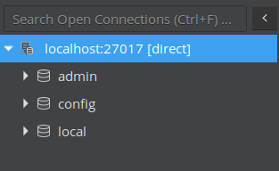<br/>

By default, there are 3 DB like above in the newly created MongoDB. Let’s create a new DB and add new data in there

* Create a new DB and insert some data

<br/>

Here, I already create new **`DB`** named test_db, a collection name **`test_collection`**, and inside that collection there 1 document

* Stop and delete the container

```
$ docker container stop mongo-docker
```


<br/>

```
$ docker container rm mongo-docker
```


<br/>

* Create and start the container again using the same command in steps 3 and 4

* Check DB again using Mongo client

<br/>

You will see, that your data is still there. Congratulation!

That is one method of how to manage data in docker, there is still many ways to manage data in docker. Please be sure to read the [documentation](https://docs.docker.com/storage/). In there you will know what method to use and how to use it for your needs.

## Docker Compose

We already learn to integrate our containers. In the previous example, we use 3 containers, but what if our application or system needs more than that? Doing it manually every step will be a problem, right? So, Docker Compose will help us automate that process.

Basically, there are 3 steps to use Docker Compose, these steps are:

1. Define your app’s environment with a **`Dockerfile`** so it can be reproduced anywhere.

1. Define the services that make up your app in **`docker-compose.yml`** to be run together in an isolated environment.

1. Run **`docker-compose up`** and Compose starts and runs your entire app.

In step 1, we already learn how to create **`Dockerfile`** so we will focus on step 2, how to create **`docker-compose.yml`** file, and step 3, how to run it.

Let's create our**`docker-compose.yml`** ,

```
version: "3.9" # optional since v1.27.0

services:
  db:
    container_name: postgres-comose
    image: postgres
    ports:
      - 5432:5432
    networks:
      - compose-network
    environment:
      - POSTGRES_DB=docker-demo
      - POSTGRES_PASSWORD=mysecretpassword
  cache:
    container_name: redis-compose
    image: redis
    ports:
      - 6379:6379
    networks:
      - compose-network
  app:
    container_name: golang-compose
    # image: app-golang:1.0
    build:
      context: .
      dockerfile: Dockerfile
    ports:
      - 8080:8080
    restart: unless-stopped
    networks:
      - compose-network
    depends_on:
      - db
      - cache
    environment:
      - REDIS_HOST=redis-compose
      - DB_HOST=postgres-compose
      - MYNAME=REPOERNA

networks:
  compose-network:
    name: new-example-network
```


***Note: in the app service environment, we use REDIS_HOST and DB_HOST using Redis and Postgres container name**

Okay, I will explain what we write. At the root of the file, we have:

* **`version`** define Compose release. Each release has different features and parameters that we can use. You can read the compatibility matrix of each version **[here](https://docs.docker.com/compose/compose-file/compose-versioning/)**. If you omit the **`version`by** default, it will use version 1.

* **`services`** defined all services in our system. In our example, before we use Postgres, Redis, and golang app, those 3 services will be defined here.

* **`network`** define network will be used, if you haven’t created the network, it will be automatically created, and you can create more than one network here.

Inside services, there is the service name; we have DB, cache, and app. On every service, we will define a parameter that will be used on each service. these parameters are:

* **`container_name`** defines name services container.

* **`image`** define an image that will be used for creating the container.

* **`port`** define port binding to exposed the port inside a container with the environment outside.

* **`networks`** define a network that will be used by services.

* **`depends_on`** define other services that needed by app services.

* **`environment`** define environment variable inside the container.

In **`app`** service, instead of using an image, we will use `build` to build the image, below **`build`** there is **`context`** that define the location of Dockerfle that will be used to build the image and **`dockerfile`** to define Dockerfile filename.

To run Docker Compose, we need to use some commands, you can check in your terminal by using

```
$ docker-compose
```


It will show you a list of commands and a short description of its function. You need to know how to use it properly. There are common commands that I frequently used:

* **`docker-compose build`**

It will rebuild the image if you are using **`build`** instead of **`image`** in your **`docker-compose.yml`**, if your services using existing images, there will be an error occurred.

* **`docker-compose up -d`**

It will create and start containers, it is best to use`-d` or daemon mode, to run the process in the background.

* **`docker-compose down`**

it will stop and remove containers, networks, images, and volumes. Please beware if you using a database in your services, when you use this command, the data will also be removed.

So, let's run the Docker Compose

* Rebuild the image

```
$ docker-compose build
```


this process will be the same with **`docker build`**

* Start services

```
$ docker-compose up -d
```


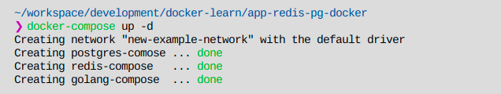<br/>

* Check our application

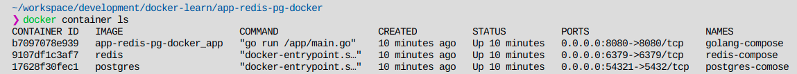<br/>

<br/>

Our services are up! No error occurred.

* Clean Up

```
$ docker-compose down
```


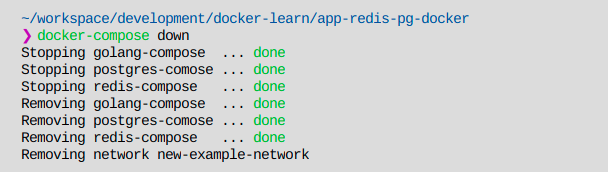<br/>

## Docker Tools — Kitematic

Docker tool is software that you can use to help you manage Docker using GUI. Docker has its own tools called Docker Desktop, but it is only for Windows and macOS. For Linux, I preferred using Kitematic because it also can run on Windows, macOS. It also has more features than Docker Desktop.

The features are:

1. Create, delete, start & stop a container

1. View containers logs

1. Managing volumes

1. Add environment variables

1. Command-Line Access

You can see the details on

You can see the details on [Kitematic website](https://kitematic.com/) or [docker documentation](https://docs.docker.com/kitematic/userguide/).

## [Docker Cheat Sheet](https://www.docker.com/sites/default/files/d8/2019-09/docker-cheat-sheet.pdf)

## Refrence

[1] [What Is Dockerfile: Everything You Need to Know](https://www.simplilearn.com/tutorials/docker-tutorial/what-is-dockerfile)

[2] [Docker Containers and Container Cloud Services](https://www.oracle.com/cloud-native/container-registry/what-is-docker/)

[3] [Basic about Docker in the Oracle](http://oracle-help.com/oracle-cloud/basic-docker-oracle/)